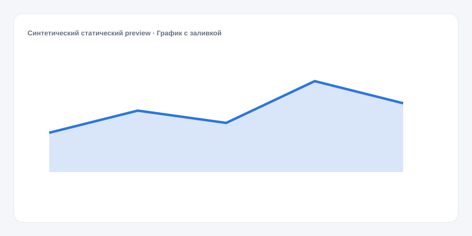

# График с заливкой

**Русский** · [English](README_en.md)

[← Cookbook](../../README.md) · [Web](https://adikant.github.io/datalens-dev-mcp/recipes/area-chart/?lang=ru)

Линия с заливкой до нулевой оси для акцента на объёме.

## Когда использовать

Объём во времени, когда площадь под линией помогает чтению.

## Особенности поведения

Значения не накапливаются: Prepare рисует ровно переданный ряд.

## Контракт Sources

| Alias | Назначение | Тип / формат | Поведение null | Пример |
| --- | --- | --- | --- | --- |
| `bucket` | Начало отображаемого временного интервала после группировки — например дня, недели или месяца. Значения должны сортироваться по времени. | `string` / ISO date or interval key | Строка отбрасывается | `"2026-01-01"` |
| `value` | Числовое значение отметки | `number` / finite number | Разрыв линии или пропуск отметки | `42` |

## Что менять

1. Замените только Meta и Sources, сохранив aliases.
2. Для необязательных подписей, палитры, единиц и форматов используйте блок CUSTOMIZE.

## Файлы

- [`meta.json`](code/ru/meta.json)
- [`params.js`](code/ru/params.js)
- [`sources.js`](code/ru/sources.js)
- [`controls.js`](code/ru/controls.js)
- [`prepare.js`](code/ru/prepare.js)
- [`schema.json`](code/ru/schema.json)
- [`example_input.json`](code/ru/example_input.json)
