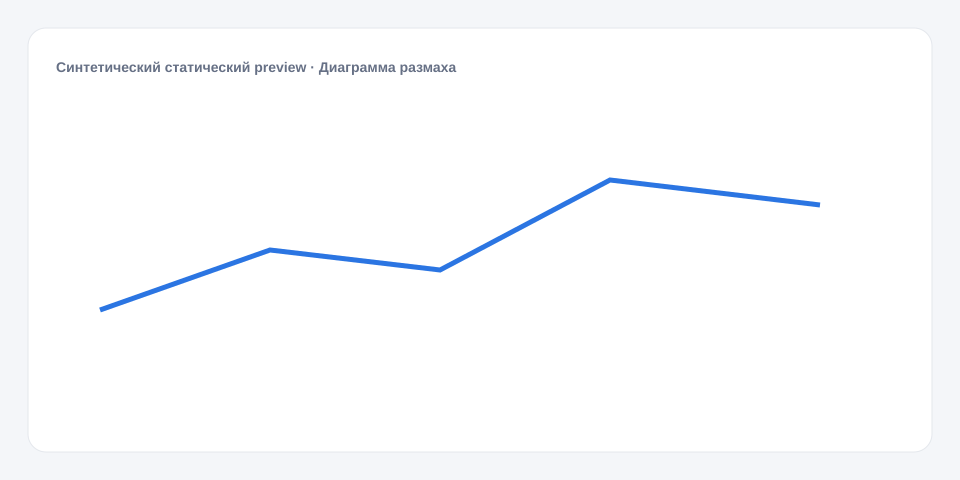

# Диаграмма размаха

**Русский** · [English](README_en.md)

[← Cookbook](../../README.md) · [Web](https://adikant.github.io/datalens-dev-mcp/recipes/box-plot/?lang=ru)

Пять числовых характеристик распределения по группам.

## Когда использовать

Сравнение медианы, разброса и крайних значений.

## Особенности поведения

Требуется порядок min ≤ q1 ≤ median ≤ q3 ≤ max.

## Контракт Sources

| Alias | Назначение | Тип / формат | Поведение null | Пример |
| --- | --- | --- | --- | --- |
| `label` | Отображаемая категория | `string` / display label | Строка отбрасывается | `"Категория A"` |
| `value` | Числовое значение отметки | `number` / finite number | Разрыв линии или пропуск отметки | `42` |
| `x` | Координата по горизонтальной оси | `number` / finite number | Точка отбрасывается | `24` |
| `y` | Координата по вертикальной оси | `number` / finite number | Точка отбрасывается | `68` |
| `size` | Относительная площадь пузырька | `number` / positive finite number | Точка отбрасывается | `34` |
| `min` | Минимум распределения | `number` / finite number | Группа отбрасывается | `10` |
| `q1` | Первый квартиль | `number` / finite number | Группа отбрасывается | `22` |
| `median` | Медиана | `number` / finite number | Группа отбрасывается | `31` |
| `q3` | Третий квартиль | `number` / finite number | Группа отбрасывается | `44` |
| `max` | Максимум распределения | `number` / finite number | Группа отбрасывается | `63` |

## Что менять

1. Замените только Meta и Sources, сохранив aliases.
2. Для необязательных подписей, палитры, единиц и форматов используйте блок CUSTOMIZE.

## Файлы

- [`meta.json`](code/ru/meta.json)
- [`params.js`](code/ru/params.js)
- [`sources.js`](code/ru/sources.js)
- [`controls.js`](code/ru/controls.js)
- [`prepare.js`](code/ru/prepare.js)
- [`schema.json`](code/ru/schema.json)
- [`example_input.json`](code/ru/example_input.json)
