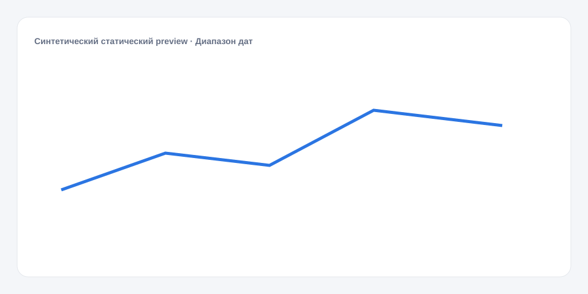

# Диапазон дат

**Русский** · [English](README_en.md)

[← Cookbook](../../README.md) · [Web](https://adikant.github.io/datalens-dev-mcp/recipes/date-range-selector/?lang=ru)

Диапазон с двумя явными параметрами.

## Когда использовать

Общий период дашборда через dateFrom и dateTo.

## Особенности поведения

Неполный ручной диапазон не меняет подтверждённые Params.

## Контракт Sources

Внешний источник не требуется.

## Что менять

1. Замените только Meta и Sources, сохранив aliases.
2. Для необязательных подписей, палитры, единиц и форматов используйте блок CUSTOMIZE.

## Файлы

- [`meta.json`](code/ru/meta.json)
- [`params.js`](code/ru/params.js)
- [`sources.js`](code/ru/sources.js)
- [`controls.js`](code/ru/controls.js)
- [`schema.json`](code/ru/schema.json)
- [`example_input.json`](code/ru/example_input.json)
