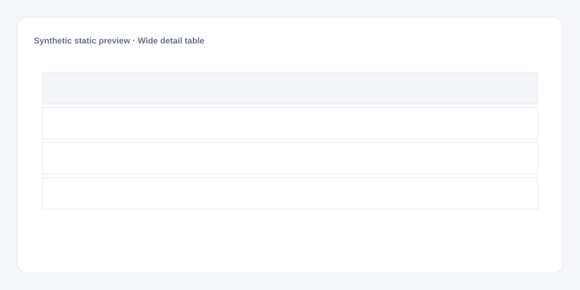

# Wide detail table

[Русский](README.md) · **English**

[← Cookbook](../../README_en.md) · [Web](https://adikant.github.io/datalens-dev-mcp/recipes/detail-table/?lang=en)

Pinned keys, formats, hints, pagination, and horizontal scrolling.

## When to use it

Drill-down detail beneath an aggregated chart.

## Specific behavior

entity_id and entity_name are pinned left; remaining columns scroll.

## Sources contract

| Alias | Purpose | Type / format | Null behavior | Example |
| --- | --- | --- | --- | --- |
| `entity_id` | Stable row identifier | `string` / stable identifier | The row is discarded | `"OBJ-1042"` |
| `entity_name` | Object name | `string` / display text | entity_id is shown | `"Object 1042"` |
| `status` | Technical status key | `string` / status key | Neutral styling is used | `"ready"` |
| `owner` | Responsible owner | `string` / display text | A dash is shown | `"Team A"` |
| `updated_at` | Last update time | `string` / ISO-8601 datetime | Shows no data | `"2026-01-05T12:30:00Z"` |
| `amount` | Numeric amount to format | `number` / finite number | A dash is shown | `1250.5` |

## What to change

1. Replace Meta and Sources only; keep aliases stable.
2. Use the CUSTOMIZE block for optional labels, palette, units, and formatting.

## Files

- [`meta.json`](code/en/meta.json)
- [`params.js`](code/en/params.js)
- [`sources.js`](code/en/sources.js)
- [`prepare.js`](code/en/prepare.js)
- [`config.js`](code/en/config.js)
- [`schema.json`](code/en/schema.json)
- [`example_input.json`](code/en/example_input.json)
