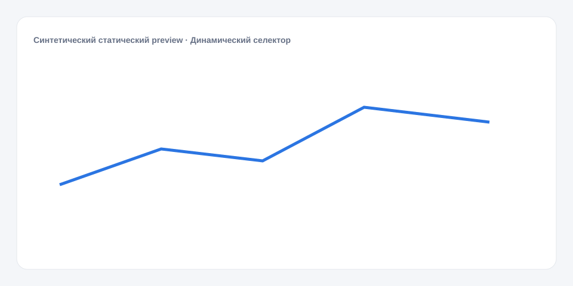

# Динамический селектор

**Русский** · [English](README_en.md)

[← Cookbook](../../README.md) · [Web](https://adikant.github.io/datalens-dev-mcp/recipes/dynamic-selector/?lang=ru)

Варианты поступают из dataset source.

## Когда использовать

Справочник, обновляющийся вместе с данными.

## Особенности поведения

Повторы value удаляются; title может быть null.

## Контракт Sources

| Alias | Назначение | Тип / формат | Поведение null | Пример |
| --- | --- | --- | --- | --- |
| `value` | Стабильное значение варианта, записываемое в Params | `string` / stable option key | Вариант отбрасывается | `"segment_a"` |
| `title` | Отображаемая подпись варианта | `string` / display label | Используется value | `"Сегмент A"` |

## Что менять

1. Замените только Meta и Sources, сохранив aliases.
2. Для необязательных подписей, палитры, единиц и форматов используйте блок CUSTOMIZE.

## Файлы

- [`meta.json`](code/ru/meta.json)
- [`params.js`](code/ru/params.js)
- [`sources.js`](code/ru/sources.js)
- [`controls.js`](code/ru/controls.js)
- [`schema.json`](code/ru/schema.json)
- [`example_input.json`](code/ru/example_input.json)
