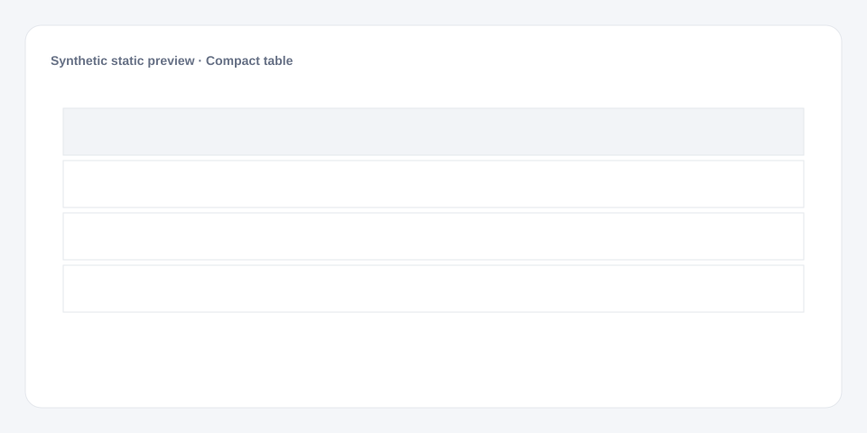

# Compact table

[Русский](README.md) · **English**

[← Cookbook](../../README_en.md) · [Web](https://adikant.github.io/datalens-dev-mcp/recipes/editor-table/?lang=en)

A native table with a bar cell and pagination.

## When to use it

Exact values and compact operational lists.

## Specific behavior

value renders as a bar cell; page_size is bounded to 1–200.

## Sources contract

| Alias | Purpose | Type / format | Null behavior | Example |
| --- | --- | --- | --- | --- |
| `status` | Technical status key | `string` / status key | Neutral styling is used | `"ready"` |
| `item` | Primary row label | `string` / display text | An empty label is shown | `"Example row"` |
| `value` | Numeric mark value | `number` / finite number | Line gap or omitted mark | `42` |

## What to change

1. Replace Meta and Sources only; keep aliases stable.
2. Use the CUSTOMIZE block for optional labels, palette, units, and formatting.

## Files

- [`meta.json`](code/en/meta.json)
- [`params.js`](code/en/params.js)
- [`sources.js`](code/en/sources.js)
- [`prepare.js`](code/en/prepare.js)
- [`config.js`](code/en/config.js)
- [`schema.json`](code/en/schema.json)
- [`example_input.json`](code/en/example_input.json)
