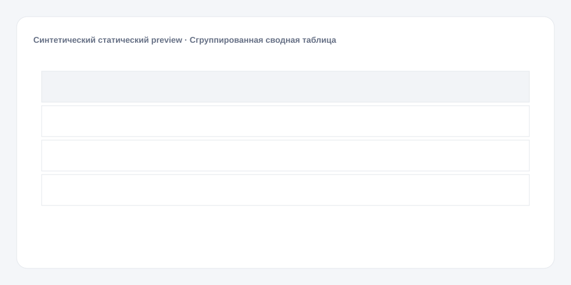

# Сгруппированная сводная таблица

**Русский** · [English](README_en.md)

[← Cookbook](../../README.md) · [Web](https://adikant.github.io/datalens-dev-mcp/recipes/grouped-summary-table/?lang=ru)

Многоуровневые заголовки и progress/bar-ячейки.

## Когда использовать

Компактная сводка по категориям с выполнением плана.

## Особенности поведения

head.sub объединяет completed, total и progress в группу «Выполнение».

## Контракт Sources

| Alias | Назначение | Тип / формат | Поведение null | Пример |
| --- | --- | --- | --- | --- |
| `category` | Категория верхнего уровня | `string` / display label | Строка отбрасывается | `"Группа A"` |
| `completed` | Выполненная часть | `number` / non-negative number | Используется 0 | `72` |
| `total` | Общий объём для progress | `number` / positive number | Progress не рассчитывается | `100` |

## Что менять

1. Замените только Meta и Sources, сохранив aliases.
2. Для необязательных подписей, палитры, единиц и форматов используйте блок CUSTOMIZE.

## Файлы

- [`meta.json`](code/ru/meta.json)
- [`params.js`](code/ru/params.js)
- [`sources.js`](code/ru/sources.js)
- [`prepare.js`](code/ru/prepare.js)
- [`config.js`](code/ru/config.js)
- [`schema.json`](code/ru/schema.json)
- [`example_input.json`](code/ru/example_input.json)
