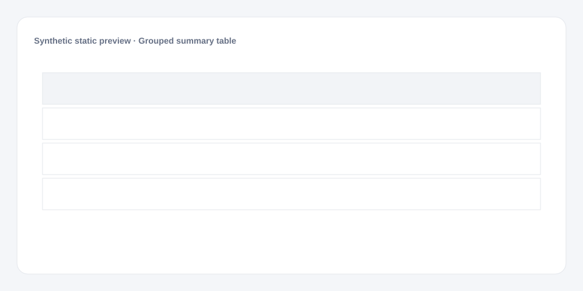

# Grouped summary table

[Русский](README.md) · **English**

[← Cookbook](../../README_en.md) · [Web](https://adikant.github.io/datalens-dev-mcp/recipes/grouped-summary-table/?lang=en)

Multi-level headers and progress/bar cells.

## When to use it

A compact category summary with plan completion.

## Specific behavior

head.sub groups completed, total, and progress under Completion.

## Sources contract

| Alias | Purpose | Type / format | Null behavior | Example |
| --- | --- | --- | --- | --- |
| `category` | Top-level category | `string` / display label | The row is discarded | `"Group A"` |
| `completed` | Completed portion | `number` / non-negative number | Zero is used | `72` |
| `total` | Total used by progress | `number` / positive number | Progress is not calculated | `100` |

## What to change

1. Replace Meta and Sources only; keep aliases stable.
2. Use the CUSTOMIZE block for optional labels, palette, units, and formatting.

## Files

- [`meta.json`](code/en/meta.json)
- [`params.js`](code/en/params.js)
- [`sources.js`](code/en/sources.js)
- [`prepare.js`](code/en/prepare.js)
- [`config.js`](code/en/config.js)
- [`schema.json`](code/en/schema.json)
- [`example_input.json`](code/en/example_input.json)
