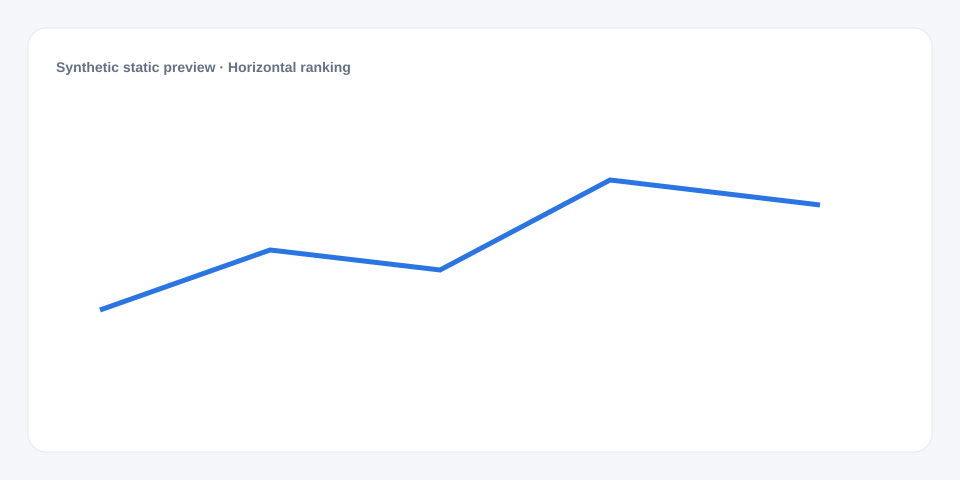

# Horizontal ranking

[Русский](README.md) · **English**

[← Cookbook](../../README_en.md) · [Web](https://adikant.github.io/datalens-dev-mcp/recipes/horizontal-bar/?lang=en)

A sorted category comparison with direct values.

## When to use it

Rankings and long category labels.

## Specific behavior

Large row sets use vertical scrolling.

## Sources contract

| Alias | Purpose | Type / format | Null behavior | Example |
| --- | --- | --- | --- | --- |
| `label` | Displayed category | `string` / display label | The row is discarded | `"Category A"` |
| `value` | Numeric mark value | `number` / finite number | Line gap or omitted mark | `42` |

## What to change

1. Replace Meta and Sources only; keep aliases stable.
2. Use the CUSTOMIZE block for optional labels, palette, units, and formatting.

## Files

- [`meta.json`](code/en/meta.json)
- [`params.js`](code/en/params.js)
- [`sources.js`](code/en/sources.js)
- [`controls.js`](code/en/controls.js)
- [`prepare.js`](code/en/prepare.js)
- [`schema.json`](code/en/schema.json)
- [`example_input.json`](code/en/example_input.json)
