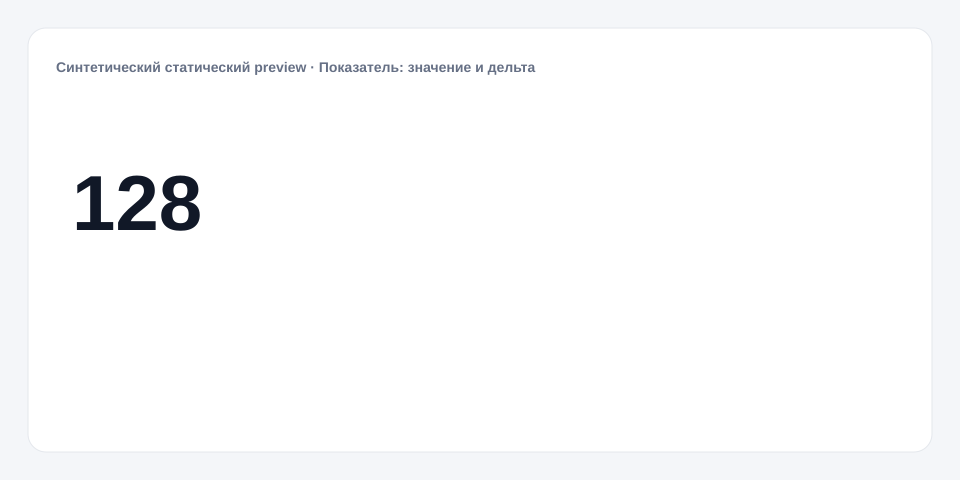

# Показатель: значение и дельта

**Русский** · [English](README_en.md)

[← Cookbook](../../README.md) · [Web](https://adikant.github.io/datalens-dev-mcp/recipes/kpi-value-delta/?lang=ru)

Текущее значение и явно переданное сравнение.

## Когда использовать

План, цель или предыдущий период с понятным смыслом дельты.

## Особенности поведения

Дельта математическая; хороший или плохой знак не предполагается.

## Контракт Sources

| Alias | Назначение | Тип / формат | Поведение null | Пример |
| --- | --- | --- | --- | --- |
| `current_value` | Текущее значение показателя | `number` / finite number | Показывается состояние без данных | `128` |
| `comparator_value` | Явное значение для сравнения | `number` / finite number | Дельта не рассчитывается | `120` |

## Что менять

1. Замените только Meta и Sources, сохранив aliases.
2. Для необязательных подписей, палитры, единиц и форматов используйте блок CUSTOMIZE.

## Файлы

- [`meta.json`](code/ru/meta.json)
- [`params.js`](code/ru/params.js)
- [`sources.js`](code/ru/sources.js)
- [`controls.js`](code/ru/controls.js)
- [`prepare.js`](code/ru/prepare.js)
- [`schema.json`](code/ru/schema.json)
- [`example_input.json`](code/ru/example_input.json)
