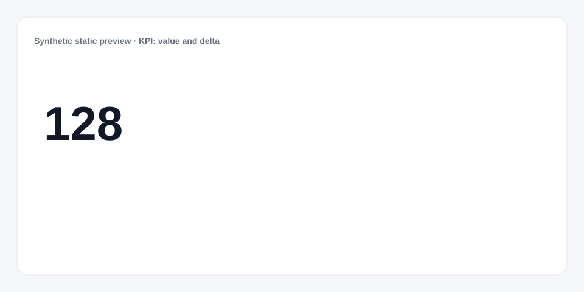

# KPI: value and delta

[Русский](README.md) · **English**

[← Cookbook](../../README_en.md) · [Web](https://adikant.github.io/datalens-dev-mcp/recipes/kpi-value-delta/?lang=en)

A current value with an explicitly supplied comparator.

## When to use it

Plan, target, or prior period with a clear delta meaning.

## Specific behavior

The delta is mathematical and does not infer good or bad direction.

## Sources contract

| Alias | Purpose | Type / format | Null behavior | Example |
| --- | --- | --- | --- | --- |
| `current_value` | Current metric value | `number` / finite number | Shows the empty state | `128` |
| `comparator_value` | Explicit comparison value | `number` / finite number | Delta is not calculated | `120` |

## What to change

1. Replace Meta and Sources only; keep aliases stable.
2. Use the CUSTOMIZE block for optional labels, palette, units, and formatting.

## Files

- [`meta.json`](code/en/meta.json)
- [`params.js`](code/en/params.js)
- [`sources.js`](code/en/sources.js)
- [`controls.js`](code/en/controls.js)
- [`prepare.js`](code/en/prepare.js)
- [`schema.json`](code/en/schema.json)
- [`example_input.json`](code/en/example_input.json)
