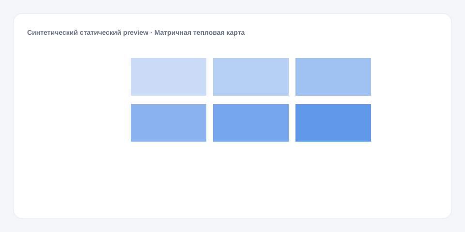

# Матричная тепловая карта

**Русский** · [English](README_en.md)

[← Cookbook](../../README.md) · [Web](https://adikant.github.io/datalens-dev-mcp/recipes/matrix-heatmap/?lang=ru)

Интенсивность на пересечении двух категориальных координат.

## Когда использовать

Поиск горячих зон по категории и временному интервалу или второй категории.

## Особенности поведения

label — горизонтальная координата, group — вертикальная, value — цвет.

## Контракт Sources

| Alias | Назначение | Тип / формат | Поведение null | Пример |
| --- | --- | --- | --- | --- |
| `label` | Отображаемая категория | `string` / display label | Строка отбрасывается | `"Категория A"` |
| `group` | Группа, ряд или вторая координата матрицы | `string` / series label | Подставляется общая группа | `"Текущий период"` |
| `value` | Числовое значение отметки | `number` / finite number | Разрыв линии или пропуск отметки | `42` |
| `target` | Целевое значение маркера | `number` / finite number | Строка не показывается | `50` |

## Что менять

1. Замените только Meta и Sources, сохранив aliases.
2. Для необязательных подписей, палитры, единиц и форматов используйте блок CUSTOMIZE.

## Файлы

- [`meta.json`](code/ru/meta.json)
- [`params.js`](code/ru/params.js)
- [`sources.js`](code/ru/sources.js)
- [`controls.js`](code/ru/controls.js)
- [`prepare.js`](code/ru/prepare.js)
- [`schema.json`](code/ru/schema.json)
- [`example_input.json`](code/ru/example_input.json)
