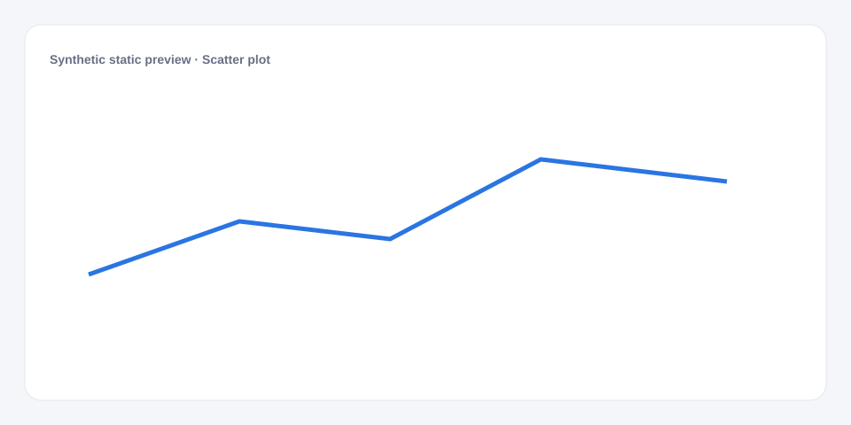

# Scatter plot

[Русский](README.md) · **English**

[← Cookbook](../../README_en.md) · [Web](https://adikant.github.io/datalens-dev-mcp/recipes/scatter/?lang=en)

Relationship between two numeric measures.

## When to use it

Finding association, clusters, and outliers.

## Specific behavior

Each row becomes one x/y point.

## Sources contract

| Alias | Purpose | Type / format | Null behavior | Example |
| --- | --- | --- | --- | --- |
| `label` | Displayed category | `string` / display label | The row is discarded | `"Category A"` |
| `value` | Numeric mark value | `number` / finite number | Line gap or omitted mark | `42` |
| `x` | Horizontal-axis coordinate | `number` / finite number | The point is discarded | `24` |
| `y` | Vertical-axis coordinate | `number` / finite number | The point is discarded | `68` |
| `size` | Relative bubble area | `number` / positive finite number | The point is discarded | `34` |
| `min` | Distribution minimum | `number` / finite number | The group is discarded | `10` |
| `q1` | First quartile | `number` / finite number | The group is discarded | `22` |
| `median` | Median | `number` / finite number | The group is discarded | `31` |
| `q3` | Third quartile | `number` / finite number | The group is discarded | `44` |
| `max` | Distribution maximum | `number` / finite number | The group is discarded | `63` |

## What to change

1. Replace Meta and Sources only; keep aliases stable.
2. Use the CUSTOMIZE block for optional labels, palette, units, and formatting.

## Files

- [`meta.json`](code/en/meta.json)
- [`params.js`](code/en/params.js)
- [`sources.js`](code/en/sources.js)
- [`controls.js`](code/en/controls.js)
- [`prepare.js`](code/en/prepare.js)
- [`schema.json`](code/en/schema.json)
- [`example_input.json`](code/en/example_input.json)
