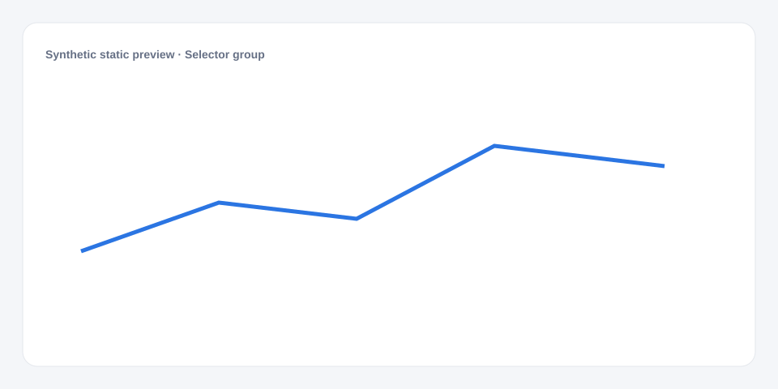

# Selector group

[Русский](README.md) · **English**

[← Cookbook](../../README_en.md) · [Web](https://adikant.github.io/datalens-dev-mcp/recipes/selector-group/?lang=en)

A period, static filter, and dynamic dictionary.

## When to use it

One strip of related parameters.

## Specific behavior

Controls use two rows and update immediately.

## Sources contract

| Alias | Purpose | Type / format | Null behavior | Example |
| --- | --- | --- | --- | --- |
| `value` | Stable option value written to Params | `string` / stable option key | The option is discarded | `"segment_a"` |
| `title` | Displayed option label | `string` / display label | value is used | `"Segment A"` |

## What to change

1. Replace Meta and Sources only; keep aliases stable.
2. Use the CUSTOMIZE block for optional labels, palette, units, and formatting.

## Files

- [`meta.json`](code/en/meta.json)
- [`params.js`](code/en/params.js)
- [`sources.js`](code/en/sources.js)
- [`controls.js`](code/en/controls.js)
- [`schema.json`](code/en/schema.json)
- [`example_input.json`](code/en/example_input.json)
