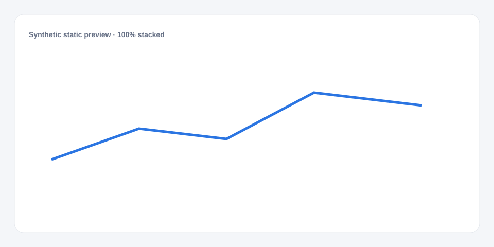

# 100% stacked

[Русский](README.md) · **English**

[← Cookbook](../../README_en.md) · [Web](https://adikant.github.io/datalens-dev-mcp/recipes/stacked-100/?lang=en)

Part-to-whole composition in percentages.

## When to use it

A small set of mutually exclusive parts of one total.

## Specific behavior

Requires non-negative values and a positive total.

## Sources contract

| Alias | Purpose | Type / format | Null behavior | Example |
| --- | --- | --- | --- | --- |
| `label` | Displayed category | `string` / display label | The row is discarded | `"Category A"` |
| `group` | Group, series, or second matrix coordinate | `string` / series label | A shared group is used | `"Current period"` |
| `value` | Numeric mark value | `number` / finite number | Line gap or omitted mark | `42` |
| `target` | Target marker value | `number` / finite number | The row is not shown | `50` |

## What to change

1. Replace Meta and Sources only; keep aliases stable.
2. Use the CUSTOMIZE block for optional labels, palette, units, and formatting.

## Files

- [`meta.json`](code/en/meta.json)
- [`params.js`](code/en/params.js)
- [`sources.js`](code/en/sources.js)
- [`controls.js`](code/en/controls.js)
- [`prepare.js`](code/en/prepare.js)
- [`schema.json`](code/en/schema.json)
- [`example_input.json`](code/en/example_input.json)
