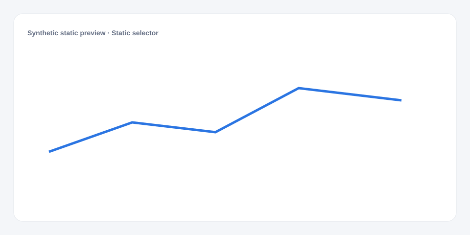

# Static selector

[Русский](README.md) · **English**

[← Cookbook](../../README_en.md) · [Web](https://adikant.github.io/datalens-dev-mcp/recipes/static-selector/?lang=en)

A compact select with explicit options.

## When to use it

A small stable list of modes or statuses.

## Specific behavior

Values and labels are declared directly in Controls.

## Sources contract

No external source is required.

## What to change

1. Replace Meta and Sources only; keep aliases stable.
2. Use the CUSTOMIZE block for optional labels, palette, units, and formatting.

## Files

- [`meta.json`](code/en/meta.json)
- [`params.js`](code/en/params.js)
- [`sources.js`](code/en/sources.js)
- [`controls.js`](code/en/controls.js)
- [`schema.json`](code/en/schema.json)
- [`example_input.json`](code/en/example_input.json)
