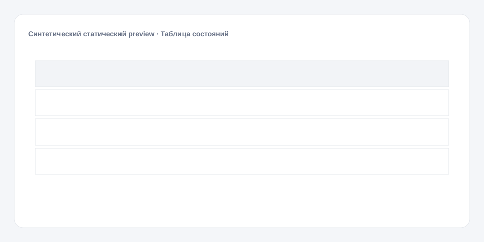

# Таблица состояний

**Русский** · [English](README_en.md)

[← Cookbook](../../README.md) · [Web](https://adikant.github.io/datalens-dev-mcp/recipes/status-table/?lang=ru)

Условное оформление, безопасная ссылка и явное пустое состояние.

## Когда использовать

Мониторинг актуального состояния объектов.

## Особенности поведения

details_url используется только при абсолютном https URL.

## Контракт Sources

| Alias | Назначение | Тип / формат | Поведение null | Пример |
| --- | --- | --- | --- | --- |
| `entity_id` | Стабильный идентификатор строки | `string` / stable identifier | Строка отбрасывается | `"OBJ-1042"` |
| `item` | Основная подпись строки | `string` / display text | Показывается пустая подпись | `"Пример строки"` |
| `status` | Технический ключ состояния | `string` / status key | Используется нейтральное оформление | `"ready"` |
| `updated_at` | Время последнего изменения | `string` / ISO-8601 datetime | Показывается «нет данных» | `"2026-01-05T12:30:00Z"` |
| `details_url` | Безопасная ссылка на подробности | `string` / absolute https URL | Ссылка не создаётся | `"https://example.invalid/item/1042"` |

## Что менять

1. Замените только Meta и Sources, сохранив aliases.
2. Для необязательных подписей, палитры, единиц и форматов используйте блок CUSTOMIZE.

## Файлы

- [`meta.json`](code/ru/meta.json)
- [`params.js`](code/ru/params.js)
- [`sources.js`](code/ru/sources.js)
- [`prepare.js`](code/ru/prepare.js)
- [`config.js`](code/ru/config.js)
- [`schema.json`](code/ru/schema.json)
- [`example_input.json`](code/ru/example_input.json)
