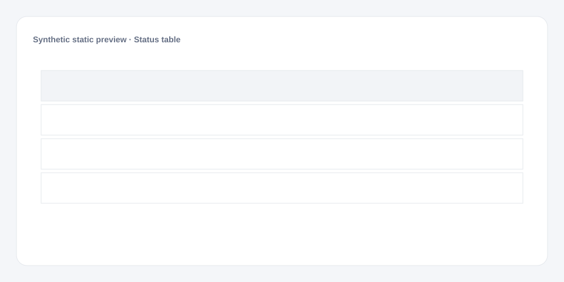

# Status table

[Русский](README.md) · **English**

[← Cookbook](../../README_en.md) · [Web](https://adikant.github.io/datalens-dev-mcp/recipes/status-table/?lang=en)

Conditional styling, a safe link, and an explicit empty state.

## When to use it

Monitoring the current state of items.

## Specific behavior

details_url is used only when it is an absolute https URL.

## Sources contract

| Alias | Purpose | Type / format | Null behavior | Example |
| --- | --- | --- | --- | --- |
| `entity_id` | Stable row identifier | `string` / stable identifier | The row is discarded | `"OBJ-1042"` |
| `item` | Primary row label | `string` / display text | An empty label is shown | `"Example row"` |
| `status` | Technical status key | `string` / status key | Neutral styling is used | `"ready"` |
| `updated_at` | Last update time | `string` / ISO-8601 datetime | Shows no data | `"2026-01-05T12:30:00Z"` |
| `details_url` | Safe details link | `string` / absolute https URL | No link is created | `"https://example.invalid/item/1042"` |

## What to change

1. Replace Meta and Sources only; keep aliases stable.
2. Use the CUSTOMIZE block for optional labels, palette, units, and formatting.

## Files

- [`meta.json`](code/en/meta.json)
- [`params.js`](code/en/params.js)
- [`sources.js`](code/en/sources.js)
- [`prepare.js`](code/en/prepare.js)
- [`config.js`](code/en/config.js)
- [`schema.json`](code/en/schema.json)
- [`example_input.json`](code/en/example_input.json)
