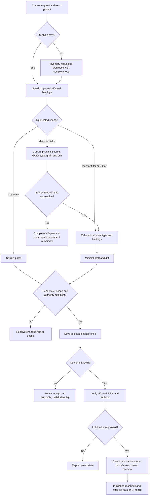

# Authorized scope and delivery

Work from the exact dashboard project/subproject and reuse its configured installation. The current request defines target, effect, and stopping point. A clear instruction to edit and deliver authorizes the necessary scoped reads, validation, save/readback and requested publish/readback. A compact plan informs the user; it does not add a pause. Resolve routine details from project context, fresh readback and schemas.

| Request | Continue through |
| --- | --- |
| Analyze; change nothing | Scoped read and report only |
| Save a draft; do not publish | Validate, save, saved readback |
| Update and publish this chart; preserve neighbors | Scoped update, save/readback, publish-from-saved, published readback |
| Delete these exact test charts | Dependency preview, preserve checks, exact scope, delete and readback |

`confirmed_delete` is the exact machine delete set matching the authorized scope and fresh preview, not proof of a fresh human click. Resolve a request to clean unused objects in a named workbook to a safe exact set through dependency reads. Revalidate changed previews; stop when changed scope or preservation conflicts cannot be resolved within the request. Failed or uncertain deletion stops the remaining objects; reconcile instead of blind retry or recreation. A list-only request and an explicit preserve instruction prohibit deletion.

Ask only when the target or effect remains ambiguous, the solution materially expands scope (including shared-source meaning, visibility or other objects), explicit constraints conflict, or a human login/secret/platform action is required. Unknown KPI polarity can be neutral; it does not require a questionnaire. A dashboard request does not authorize upstream production database writes, ACL changes, or unowned objects.

Native permission events remain host-controlled. Automatic reviewer `outcome=allow` is not a pending human response. Do not bypass a refusal, modify global configuration, or edit external skills. An external design process remains external; do not attribute its requirements to this plugin or introduce a second domain approval ceremony.

For expired credentials, follow [authentication recovery](../../datalens-inspect/references/installation-and-sdk.md#authentication-recovery) through `dl_auth_refresh`. Its configured external-browser sign-in is distinct from editing dashboard content through Browser. Reuse current same-account login authorization; pause only for an actual host denial, required user password/MFA or unresolved scope.

## Choose the affected path

This is a decision map, not a sequence to execute in full for every task. Metadata-only changes take the short branch; source checks apply when the requested metric or fields depend on them.

## Saved state, publication and restoration

Retain the complete snapshot privately when preservation or replacement needs it; a compact view is not a replacement payload. Read the current saved identity/revision and compare the affected state before writing. After each write, use the verified resulting revision for the next dependent action; a sign of drift needs an addressed refresh, not another full project/history read.

Saved and published are separate states. Before publication, compare the saved/published differences within the object being published, including differences outside your patch. Publishing the exact saved revision can also release someone else's unpublished work. Proceed only when all differences fall within the authorized publication scope; otherwise name the conflict and retain the verified saved result. Do not copy the old published snapshot over newer saved work.

For a temporary change or restore, record your own delta and its before/after values. Freshly read the target, verify that the fields you changed still have your expected values, and apply only the inverse of that delta. Preserve intervening unrelated changes. If those preconditions no longer hold, stop restoration with the exact conflicting paths; never replace the whole object with an old snapshot. Apply the same publication-scope check before publishing a restore.

## Unknown outcomes and repeat effects

Another write attempt requires reliable `not_applied` evidence (a proven pre-dispatch failure or a confirmed provider rejection with no possible earlier effect), or separate informed user authorization for another possible effect after explaining the duplicate risk. This evidence permits an in-scope corrected attempt; it does not add automatic writer retries. An attempted but unsuccessful reconcile, `identity_lookup_unavailable`, a lost object ID, and absence from inventory or name search do not prove non-application. A new `operation_id` does not make a repeat safe; general workbook authorization does not accept duplicate risk.

Keep the original operation ID and receipt. Inspect its prepared identity/destination, client reference, significant fields and content hash; do not print full source. Reconcile exact targets when available. If reliable identity is unavailable, retain unknown and continue independent authorized work. Do not recreate the missing-ID object to finish a batch. A documented provider idempotency guarantee can permit replay with the same key, but the presence of an operation_id in this plugin is only a local receipt binding and is not such a guarantee.

`not_dispatched` with `not_applied` describes a proven preparation failure. A confirmed provider rejection may instead be `dispatched` with `not_applied`; a missing response, failed readback or possible earlier composite effect remains unknown. Inspect both per-item and overall outcomes; never replay completed items in a partial batch. Historical unknown receipts remain unknown without new evidence.

## Compact continuation

Read the exact project's current `AGENTS.md`/`CONTEXT.md` when present, reusing them while current. For a handoff from another task, start with its available short summary or named artifact. Recover the result, accepted decisions, IDs/revisions, remaining work and exact evidence location; read only the missing turns next. Use the current host tool schema for pagination and turn/output limits, not a remembered argument bound. Do not combine several bounded histories or instruction files into one unbounded output; project/filter each result before returning it to the model.

Keep a short private continuation note for a long task: current scope; exact targets and branches; accepted decisions and source version; verified results; uncertain operation IDs; remaining objects; and conditions requiring a fresh read. Do not add a mandatory manifest, memory service or persistent unvalidated cache. A current bounded request is authority for that scope; an old plan is context, not authority for a new write, publish, or cleanup.

After compaction, restore that short note and revalidate mutable facts selectively. A new revision or manual edit invalidates the affected object's saved state; a runtime change invalidates active-runtime evidence; a scope change invalidates the coverage boundary. Keep stable decisions and already verified independent objects. Treat each related source named in the current continuation request as a separate evidence obligation. Read the entity and properties that establish its current state; finding its identity or listing its children does not verify its metadata. If the response omits a required fact, use an addressed object read or report that fact as unresolved. A reconciled write does not close remaining source checks.

When the user narrows or cancels effects during a pending operation, stop dispatching newly cancelled writes. Cancellation of a UI call is not proof that a remote effect was cancelled or undone. Preserve the operation ID and receipt; reconcile an already dispatched effect using `dl_operation_get`, `dl_operation_reconcile` and exact readback before deciding what happened. Continue independent authorized reads. Do not clear receipts, repeat an unknown write after compaction, or claim rollback without evidence.

For multiple workbooks/projects, keep each project's exact root, workbook and object identities separate. Track every requested target from the start; a missing dependency in one does not block independent authorized work in the others. For a request covering six workbooks, account for all six before reporting the result. Maintain one row per requested target:

| Project / workbook / object | Required change | Evidence | Remaining |
| --- | --- | --- | --- |
| `project-a / workbook-a / chart-a` | Rename title | saved readback at current revision | publish only if requested |

Do not claim overall completion until every target has a row and no required remainder. Use compact operation results (changed fields, revision and readback boundary); open `dl_operation_get(include_detail=true)` only for an unresolved detail. `no_change` means a fresh saved read matched the patch and no write was sent. Keep API save/readback, publish/readback, data proof, and Browser proof as separate evidence. A visible selector, Editor, or layout change needs relevant rendered verification; a metadata-only update does not require a full Browser tour.

Scale the final response to the request: a single rename needs the result and relevant readback, while a multi-project task needs per-target change, save/readback, requested publish/render and exact remainder. A status question or compaction continues the existing task unless the user changes it; keep accepted formulas and units rather than asking again.
